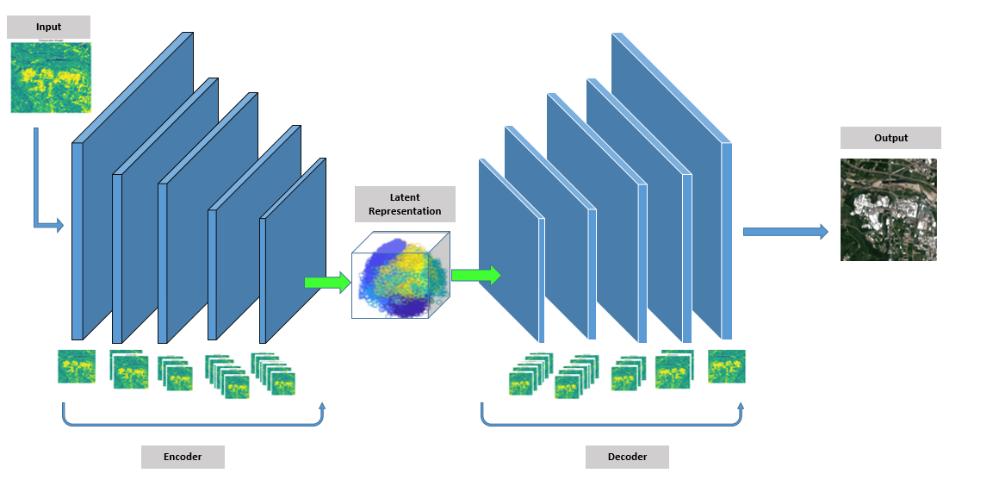

<h1>Color AutoEncoder Model</h1>
<h2>Model Diagram</h2>

<h2>Key Parameters</h2> 
<ul>
<li><strong>EPOCHS</strong>: Number of training iterations, set to 100.</li>
<li><strong>LEARNING_RATE</strong>: Learning rate for the optimizer, set to 0.001.</li>
<li><strong>DEVICE</strong>: Specifies whether the model will run on GPU (<code>'cuda'</code>) or CPU.</li>
</ul>
<h2>Model Class: <code>ColorAutoEncoder</code></h2>

This is a custom class for the colorization model, inheriting from <code>nn.Module</code>, the base class for all neural networks in PyTorch.

<h3>1. Constructor (<code>__init__</code>)</h3>

The constructor defines the layers for both the encoder (downsampling) and decoder (upsampling) parts of the autoencoder, which are organized in a symmetric manner similar to a U-Net architecture.

<h4>Downsample (Encoder)</h4>
<ul>
<li>The downsampling layers are <code>Conv2d</code> layers with stride 2, reducing the spatial resolution of the image while increasing the number of feature maps.</li>
<li>The input is a grayscale image (1 channel), and through successive convolutional layers, the number of channels (filters) increases:</li>
<ul>
<li>First layer: 1 -> 64 filters</li>
<li>Second layer: 64 -> 128 filters</li>
<li>Third layer: 128 -> 256 filters</li>
<li>Fourth layer: 256 -> 512 filters</li>
<li>Fifth layer: 512 -> 1024 filters (new deeper layer)</li>
</ul>
</ul>

<h4>Upsample (Decoder)</h4>
<ul>
<li>The decoder mirrors the encoder using <code>ConvTranspose2d</code> (transposed convolutions or deconvolutions), which upsample the feature maps back to the original image size.</li>
<li>The layers work as follows:</li>
<ul>
<li>First layer: 1024 -> 512 filters</li>
<li>Second layer: 512 -> 256 filters (after concatenating with the corresponding downsampled layer)</li>
<li>Third layer: 256 -> 128 filters</li>
<li>Fourth layer: 128 -> 64 filters</li>
<li>Fifth layer: 64 -> 3 filters (RGB color image output)</li>
</ul>
</ul>

<h4>Activation Functions</h4>
    <ul>
        <li><code>ReLU</code> is used as the activation function for all layers except the final layer.</li>
        <li>The final layer uses <code>Sigmoid</code> to output pixel values between 0 and 1 for each of the three RGB channels (producing a colored image).</li>
    </ul>
<h3>2. Forward Pass (<code>forward</code>)</h3>

The <code>forward</code> method defines how the input image flows through the network.

<h4>Encoder</h4>

The input image (grayscale) is passed through the downsampling layers, progressively reducing its size and increasing the depth of feature maps. The intermediate feature maps are stored as <code>d1</code>, <code>d2</code>, <code>d3</code>, <code>d4</code>, and <code>d5</code>.

<h4>Decoder</h4>

The decoder upsamples the feature maps back to the original image size. Each upsampling step is concatenated with the corresponding feature map from the encoder (skip connections), which is a key characteristic of the U-Net architecture.

<h4>Output</h4>

The final output is a color image (with 3 channels) that is the same spatial size as the input image.

<h2>Optimizer and Loss Function</h2>
    <ul>
        <li><strong>Optimizer (<code>Adam</code>)</strong>: An Adam optimizer is used for training the model, adjusting the model parameters based on the gradients and the learning rate.</li>
        <li><strong>Loss Function (<code>MSELoss</code>)</strong>: Mean Squared Error (MSE) is used as the loss function to compare the generated color image with the target color image.</li>
    </ul>

<h2>Overall Workflow</h2>
    <ol>
        <li>The grayscale image goes through the encoder to extract high-level features.</li>
        <li>These features are progressively upsampled back to the original resolution in the decoder while using skip connections to combine fine details from the encoder layers.</li>
        <li>The final output is a colorized image in RGB format (3 channels). The <code>sigmoid</code> activation ensures the pixel values lie between 0 and 1.</li>
        <li>The model is trained using backpropagation with the Adam optimizer and MSE loss.</li>
    </ol>

    

<h2>User Interface</h2>
    

<h2>Output Example</h2>
    

